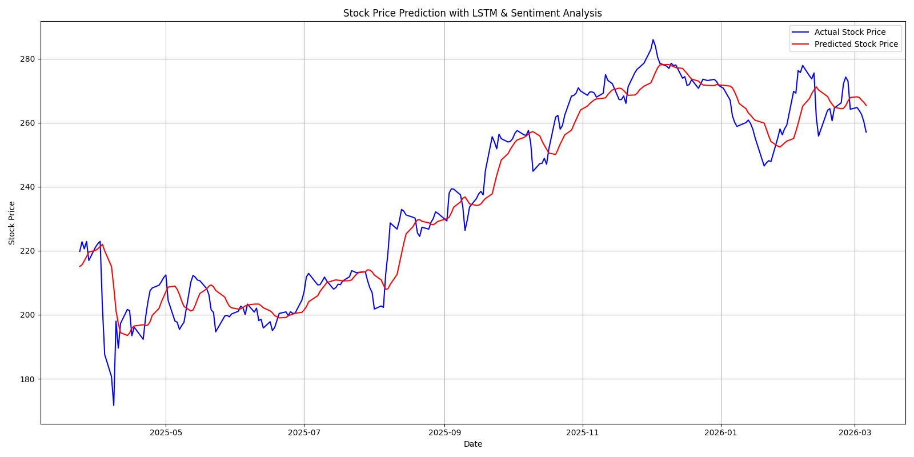

# 📈 Stock Price Prediction using LSTM with Sentiment Analysis

## 📌 Overview

This project uses a Long Short-Term Memory (LSTM) neural network to predict stock prices by combining:
- Historical stock data
- Sentiment analysis (simulated using NLP techniques)

A Flask web application is also included to provide a user-friendly interface for predictions.

## ⚙️ Tech Stack
- **Python**
- **PyTorch** *(Note: The code was updated from TensorFlow/Keras to PyTorch)*
- **Flask**
- **NumPy, Pandas**
- **Matplotlib**
- **yfinance**
- **NLTK (VADER Sentiment Analysis)**

## 🚀 Features
- Predicts stock prices using LSTM model
- Combines time-series + sentiment data
- Web interface using Flask
- Data visualization (actual vs predicted prices)
- Easy to extend with real-time data

## ⚠️ Note on Sentiment Data

Real-world sentiment data requires paid APIs (like NewsAPI, Bloomberg). For demonstration, this project uses simulated sentiment values, but the structure supports real data integration.

## 🛠️ Installation

```bash
pip install -r requirements.txt
```

## ▶️ How to Run

**🔹 Run Flask Web App**
```bash
python app.py
```
👉 **Open in browser:** [http://127.0.0.1:5000/](http://127.0.0.1:5000/)

**🔹 Run LSTM Model (Optional)**
```bash
python stock_prediction_lstm.py
```

## 🔍 How It Works

**📊 Data Collection**
- Fetches stock data using `yfinance`

**💬 Sentiment Analysis**
- Uses VADER to generate sentiment scores (simulated)

**🔄 Preprocessing**
- Scales data using `MinMaxScaler`
- Creates sequences (60-day window)

**🧠 Model Architecture**
- 2 LSTM layers (50 units)
- Dropout layers (0.2)
- Dense output layer

**📈 Output**
- Generates prediction graph (`prediction_plot.png`)
- Displays results on web interface



## 📂 Project Structure
```text
Stock_Price_Prediction/
│── app.py
│── stock_prediction_lstm.py
│── fetch_stock_data.py
│── requirements.txt
│── README.md
│
├── templates/
│   └── index.html
│
└── static/
    ├── script.js
    └── styles.css
```

## 🔮 Future Improvements
- Integrate real-time news APIs
- Use advanced NLP models (BERT)
- Deploy as a live web app
- Improve prediction accuracy

## 👩‍💻 Author

**Lalitha Singupurapu**

## ⭐ Conclusion

This project shows how combining LSTM (Deep Learning) with Sentiment Analysis improves stock price prediction and provides a practical real-world application using Flask.